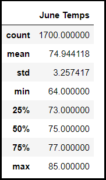
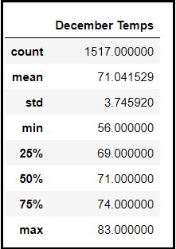
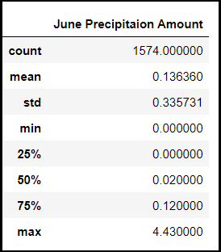
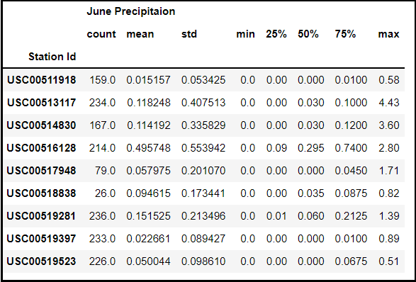

# surfs_up
Weather Analysis of data stored in SQLite database, using SQLAlchemy query tool.

## Table of Contents
- [Project Overview](#OverviewProject)
  * [Background](#Background)
  * [Purpose](#purpose)
- [Temperature comparison for June and December](#temp_compare)
- [Temperature comparison by Station for June and December](#temp_compare_station)
- [Rainfall comparison for June and December](#rain_compare)
- [Rainfall comparison by Station for June and December](#rain_compare_station)
- [Summary](#Summary)
- [Resources](#resources)
- [References](#references)

## Project Overview
### Background
We are planning to open a **'Surf n Shake'** shop in **Oahu, Hawaii**, serving surf boards and icecreams to locals and tourists. In order to invest in this project we need some real investor backing to get this off the ground. We need to analyze weather conditions of this island from 9 weather stations so that the weather is in our favor for most of the months. If the weather conditions are met then our plan is to expand to other Hawaiin islands.  

  

### Purpose

In order to open a shop in Hawaii that sells surf boards and ice creams and shakes, we need to analyze the year round weather conditions of this place so that our ventrure is not rained out of existence. A perfect weather for the shop would be mostly sunny days throughout the year and optimal amount of rain. The primary focus is to gather statistical data for the months of **June and December** and determine how the summer and winter seasons affect the shop business. For this analysis we are analyzing data from nine weather stations in Oahu, Hawaii from the year **2010 to 2017**.   

For this analysis we are using: 
**SQLite database** - the weather data is stored in SQLite database. This database is stored locally and is simple and fast to access.  
**SQLAlchemy** - We will access this database by writing queries through Pandas SQLAlchemy Query tool.  
**Flask** - We will finally display the results on the web using Flask. 

 ## Temperature comparison for June and December
The temperature analysis is based on the weather data collected from nine different stations from the year 2010 to 2017. We are focussing on the months June and Deember and comparing the temperatures for these months.

Below is the snapshot of the Summary Statistics for the months June and December.

    

We can conclude the following:
1. The number of data points available for analysis for the month of **December (1517)** are less as compared to that for the month of **June (1700)**.
2. The **Maximum temperature** in **June** is **85℉**, where as in **December** the maximum temperature is **83℉**. The max temperatures in both the months are approximately the same.
3. The **Minimum temperature** in **June** is **64℉**, whereas in **December** the minimum temperature is **56℉**. Hence the month of June seems to be more pleasant as compared to December. 
4. The **average temperature** during the month of **June** is **74.94℉**, whereas the average temperature during the month of **December** is **71℉**. It seems there is not much temperature difference in the months of June and December.

*From our analysis of the temperatures for the months of June and December, we can conclude that the weather is fovarable for the shop. We can analyze this further by getting a summary statistics of temperature for all the stations to decide which station would be most favorable for the shop.* 

 ## Temperature comparison by Station for June and December
In this analysis we are analyzing the temperature summary statistics for all the weather stations. This would help us determine which station would be most favorable for the business and also expand our business in future.   

Below is the snapshot of the Summary Statistics for each station for months June and December.

    

We can conclude the following:

1. For all the stations the **Maximum temperatures** in **June** varies from **78℉ to 85℉**, where as in **December** the maximum temperature ranges from **76℉ to 83℉**. There is a very slight variation of temperatures for all the stations in the month of June and December. Hence the weather in June and December seem to be favorable months for the shop for all the stations.
2. For all thestations the  **Minimum temperature** in **June** varies from **64℉ to 71℉**, whereas in **December** the minimum temperature ranges from **56℉ to 66℉**. From this data the **station id 'USC00514830'** seems to be the most favorable place for the shop as the temperature variation at this station is **'67℉ to 81℉' in June** and **'66℉ to 79℉' in December.** 
3. For all the stations the **average temperature** during the month of **June** varies from **71℉ to 77℉**, whereas the average temperature during the month of **December** ranges from **69℉ to 73℉**. 

*Thus by analysis of the temperatures for the month of June and December for all the stations we conclude that there is not much temperature variation for these stations. Thus these stations seem favorable for the shop. But in order to finalize our analysis we need to also analyze the rainfall amount for all these locations.* 

 ## Rainfall comparison for June and December
The precipitaion analysis is based on the weather data collected from nine different stations from the year 2010 to 2017. We are focussing on the months June and Deember and comparing the precipitaion levels for these months.

Below is the snapshot of the Summary Statistics for the months June and December.

   

We can conclude the following:
1. The number of data points available for analysis for the month of **December (1405)** are less as compared to that for the month of **June (1574)**.
1. The **Maximum rainfall** in **June** is **4.43 inches**, where as in **December** the maximum rainfall is **6.42 inches**. The max rainfall in both the months are approximately the same and differ by just 2 inches.
2. The **Minimum rainfall** in **June** is **0 inches**, whereas in **December** the minimum rainfall is **0 inches**. Hence there are some days when it has not rained at all in June and December. 
3. The **average rainfall** during the month of **June** is **0.13 inches**, whereas the average rainfall during the month of **December** is **0.21 inches**. It seems there is not much rainfall difference in the months of June and December.

*From the analysis of Precipitation levels in the month of June and December, we coclude that there is not much difference in the rain amounts, though December seems to have more  rainfall as compared to June. We will go deeper in our analysis by analyzing the precipitaions levels for each station to decide which station would be most favorable for the shop.* 

 ## Rainfall comparison By Station for June and December

In this analysis we are analyzing the precipitatiom summary statistics for all the weather stations. This would help us determine which station would be most favorable for the business and also expand our business in future.   

Below is the snapshot of the Summary Statistics for the months June and December for all stations.

    

We can conclude the following:

1. For all the stations the **Maximum rainfall** in **June** is **0.51 inches to 4.43 inches**, where as in **December** the maximum rainfall is **2.25 inches to 6.42 inches**. The station id 'USC00511918' had the maximum rainfall in the month of december as compared to other stations. 
2. For all the stations the **Minimum rainfall** in **June** is **0 inches**, whereas in **December** the minimum rainfall is **0 inches**. Hence there have been days in the month of June and December when there has been no rainfall.  
3. The **average rainfall** during the month of **June** is **0.02 inches to 0.15 inches**, whereas the average rainfall during the month of **December** is **0.13 inches to 0.62 inches**. 

*From the above analysis we can conclude that there are some stations which have had much more rainfall as compared to others. The station 'USC00511918' seemed to have the maximum rainfall. We would have to further build our analysis with the help of Box and Whisker plots to see if there are any outliers for ths data.*
 

## Summary

From our detailed analysis above we conclude the following:
1. Analysis of temperatures for the month of June and December help us conclude that the weather is favorable around the year for the shop.
2. Analysis of precipition levels for the month of June and December help us conclude that the December has more rainfall as compared to June. Hence maybe Summer season would be the most favorable season for the shop.
3. Analyzing the temperature data for every station helped us conclude that **station id 'USC00514830'** seems to be the most favorable place for the shop as the temperature variation at this station is **'67℉ to 81℉' in June** and **'66℉ to 79℉' in December.** It seems the weather is pleasant at this location all year round. 
4. Analyzing the precipitaion levels at every station helped us conclude that **station id 'USC00511918'** seemed to have the maximum rainfall. Hence this location does not seem to be the most favorable place for the shop. 

For a deeper analysis, we can do Box and Whisker plots for the temperature and rainfall data to analyze if the data contains any outliers. This will help to build a stronger analysis and be more confident about the investment in this project. 

##  Resources
[1] [Hawaii Database](hawaii.sqlite)  
[2] [Code for Weather Analysis](SurfsUp_Challenge.ipynb)  

[4] Software: 
* Python 3.10.2
* Jupyter Notebook  
* SQLite  
* SQLAlchemy  

[5] Dependencies: 
* Pandas Library 
* Matplotlib Library 
* Numpy Library 
* SQLAlchemy Library 

##  References 
[1] [SQLite Viewer](https://inloop.github.io/sqlite-viewer/)  
[2] [SQLAlchemy Documentation](https://docs.sqlalchemy.org/en/14/) 

 
